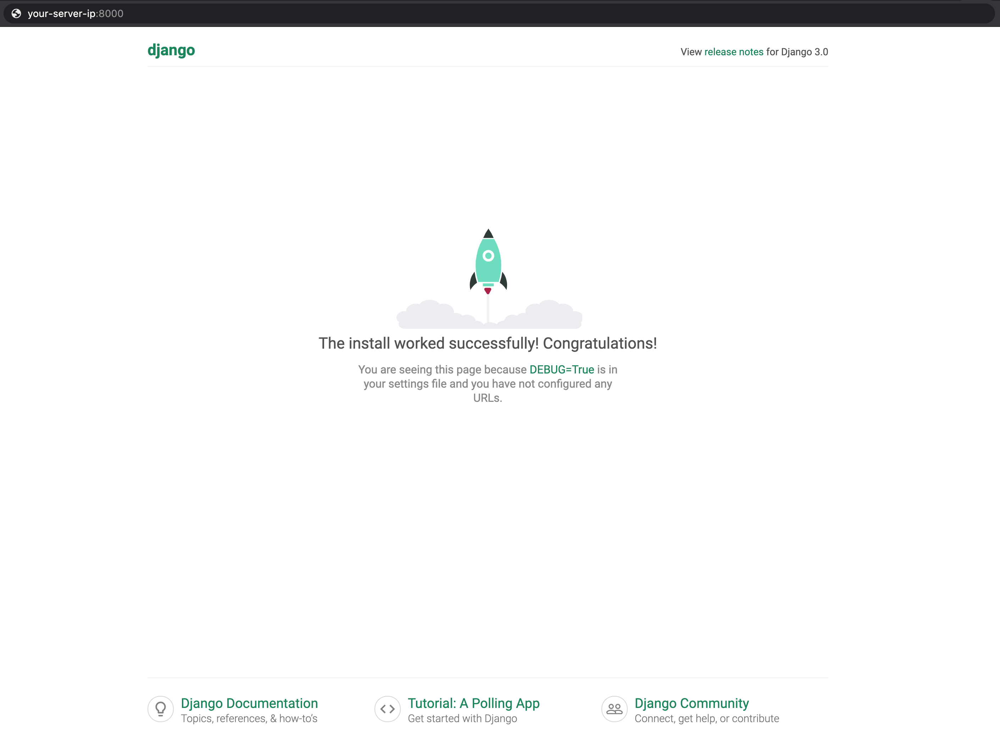
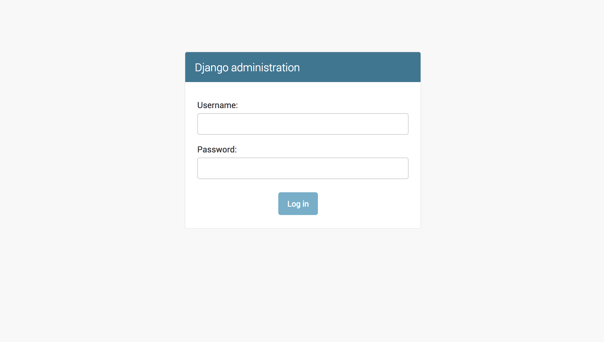

<h2 align="center"> Django Template</h2>

<p align="center">
  
  <a>
    
  </a>

  <a href="https://github.com/brian-emarquez/django-template/stargazers">
    
  </a>

  <a href="https://github.com/brian-emarquez/django-template/network">
    

  </a>
    
  </a>
  
  <a>
    
  </a>
    
  <a href="https://github.com/brian-emarquez/django-template/network">
    
  </a><br>
 
  

  
  
</p>
  
<table align="center">
  <tr>
    <td align="center" style="padding=0;width=50%;">
      
    </td>
  </tr>
</table>

---

_Tutorial para crear un Proyecto_

[Tutorial Crear Proyecto Django](https://www.digitalocean.com/community/tutorials/how-to-install-django-and-set-up-a-development-environment-on-ubuntu-20-04-es)

- Crear un entorno virtual

```bash
mkdir django-apps
cd django-apps
```
_env_

```bash
virtualenv env
```

_Activar entorno_

```bash
. env/bin/activate
```

_Intalar Django(version)_

```bash
pip install django
django-admin --version
```

_Ajustar la configuración del firewall_

```bash
sudo ufw allow 8000
```

## Iniciar el proyecto

```bash
django-admin startproject testsite
cd testsite
ls
```

```bash
cd testsite/
```

## Crear super usuario

```bash
python manage.py createsuperuser
```

- Acceder a la app web de Django

```bash
cd ~/django-apps/testsite/
python manage.py runserver 0.0.0.0:8000
```

<table align="center">
  <tr>
    <td align="center" style="padding=0;width=50%;">
      
    </td>
  </tr>
</table>


## Django Admin


```bash
http://your_server_ip:8000/admin/
```


<table align="center">
  <tr>
    <td align="center" style="padding=0;width=50%;">
      
    </td>
  </tr>
</table>

- Requirements

[https://pip.pypa.io/en/stable/cli/pip_freeze/]


_Desactivar_

```bash
deactivate
```

## (Ubuntu) Linux Permisos

_privilegios linux_
```bash
sudo chmod -R 777 file
```

_IP linux_
```bash
ifconfig
```

## Postgres Linux


_Coomando inicializacion_

```bash
service postgresql start
service postgresql status
service postgresql stop
```


## Django with Postgres Nginx andmGunicorn

_Tutorial_

Github Tutorial - [Django, Postgres, Nginx y Gunicorn](https://github.com/brian-emarquez/Django-with-Postgres-Nginx-and-Gunicorn)

## Python-Django

_Tutorial_

Github Python-Django - [https://github.com/brian-emarquez/Python-Django)